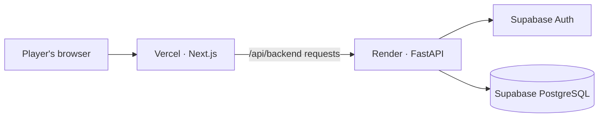

<div align="center">
  
  <h1>SensLabs</h1>
  <p><strong>Find the sensitivity that feels like yours.</strong></p>
  <p>Measure your natural mouse movement. Get a practical starting point. Then see how it feels in the range.</p>
  <p>
    <a href="https://sens-labs.vercel.app"><strong>Launch SensLabs ↗</strong></a>
    &nbsp; · &nbsp;
    <a href="#how-it-works">How it works</a>
    &nbsp; · &nbsp;
    <a href="#run-locally">Run locally</a>
  </p>
  <br />
  
  
  
  
  
</div>

---

## A better place to start

Every player moves differently. SensLabs uses your DPI and comfortable mouse movement to suggest a starting sensitivity for **VALORANT** or **Counter-Strike 2**. You can compare nearby options, try them in focused drills, and decide what feels right for you.

> SensLabs gives you a measured starting point—not a magic number. Your aim and comfort make the final call.

## What you can do

| Calibrate | Compare | Practice | Keep your progress |
| --- | --- | --- | --- |
| Measure comfortable mouse swipes and movement. | See recommended, lower, and higher sensitivity options for your game. | Try flick, tracking, and precision drills in a browser-based 3D range. | Save settings, calibrations, and practice history to your account. |

## How it works

1. **Choose your game and enter your DPI.** SensLabs uses these details to interpret your mouse movement.
2. **Move naturally.** Complete the calibration steps using comfortable mousepad swipes.
3. **Review your options.** Get a practical recommendation and nearby settings to compare.
4. **Take it to the range.** Practice, review the results, and keep the settings that feel best.

## Built with

| Area | Tools |
| --- | --- |
| Web app | Next.js 15, React 19, TypeScript, CSS Modules |
| 3D practice | Three.js |
| Motion | Motion |
| API | Python, FastAPI, Uvicorn |
| Accounts and data | Supabase Auth, PostgreSQL |
| Unit tests | Vitest |

## Run locally

### You’ll need

- Docker Desktop with Docker Compose
- A Supabase project

### 1. Configure local environment

From the repository root, copy the example environment file:

```powershell
Copy-Item .env.example .env
```

Open `.env` and set your Supabase project URL, secret key, and publishable key. Keep the secret key private; it belongs on the backend only.

### 2. Prepare the database

For a **new Supabase project**, run these files in the Supabase SQL Editor, in this order:

1. `supabase/schema.sql`
2. `supabase/migrations/20261008_auth_rate_limit.sql`

For an existing SensLabs project, apply any migrations it has not received yet. The auth rate-limit migration is required by login and signup. The `20261008_user_profiles.sql` migration is for older databases that do not yet have the `user_profiles` table.

### 3. Start the app

From the repository root:

```powershell
docker compose up --build
```

Open [http://localhost:3000](http://localhost:3000). The API is available at `http://localhost:8000`.

Stop the services with `Ctrl+C`. Run `docker compose down` when you want to stop and remove the containers.

## Production deployment

SensLabs runs as a Next.js frontend on Vercel and a FastAPI backend on Render. Supabase provides accounts and database storage.



### Vercel · frontend

- Import the GitHub repository.
- Set **Root Directory** to `web` and keep the default Next.js build settings.
- Add `API_ORIGIN` with the public HTTPS URL of your Render API.

### Render · backend

Create a Docker web service from the same repository:

- **Root Directory:** `api`
- **Dockerfile:** `Dockerfile.prod`
- **Docker context:** `.`

Set these backend environment variables in Render:

| Variable | Purpose |
| --- | --- |
| `APP_ENV` | Set to `production` to use secure session cookies and hide API documentation. |
| `SUPABASE_URL` | Your Supabase project URL. |
| `SUPABASE_SECRET_KEY` | Backend-only key for privileged database and admin operations. Never put it in Vercel or Git. |
| `SUPABASE_PUBLISHABLE_KEY` | Used by the backend for public Supabase Auth operations. |
| `API_ALLOWED_ORIGINS` | Your exact website origin, such as `https://sens-labs.vercel.app`. |
| `FORWARDED_ALLOW_IPS` | Only the trusted proxy addresses documented by your backend host. Don’t set this to `*` on a public API. |

### Supabase · accounts and email

- Enable **Confirm email** in the email authentication settings.
- Set the **Site URL** to your production Vercel URL and add it to the allowed redirect URLs.
- Configure custom SMTP so confirmation email can be delivered to your users.
- New users must confirm their email before logging in. Existing accounts are not affected.

### Before inviting players

- Confirm the Vercel deployment and Render service both show **Live/Ready**.
- Confirm `API_ALLOWED_ORIGINS` exactly matches the production website origin.
- Test signup with a new email address, click the confirmation link, then test login and saved progress.
- Keep production secrets in provider environment settings, not in the repository.

## Security notes

- The Supabase secret key is used only by the backend.
- Login sessions use short-lived `HttpOnly` cookies.
- The API checks request origins for write requests and rate-limits account creation and sign-in attempts.
- Saved calibration and practice records have size limits.

These controls reduce risk; they are not a guarantee that the application is free of vulnerabilities. Keep dependencies updated and monitor the hosting and Supabase logs.

---

<div align="center">
  <sub>Made for players who want a measured starting point—and room to make it their own.</sub>
</div>